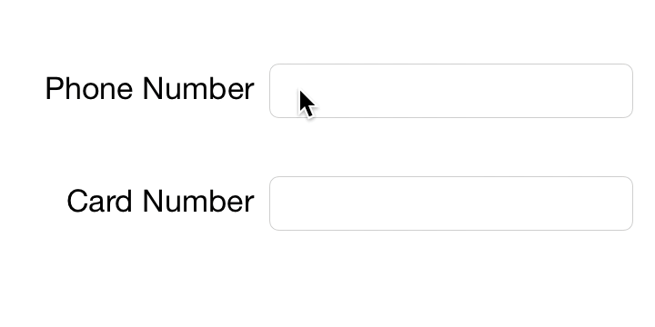

# CHRTextFieldFormatter

`CHRTextFieldFormatter` allows you to apply an input mask to a `UITextField` instance.



## Features

- Does not mute Copy/Cut/Paste events.
- Correctly calculates cursor position.
- Does not require `UITextField` subclassing.
- Provides `CHRTextMask` interface to allow custom text masking algorithm implementation.
- Subclasses `NSFormatter`.

## Implemented Masks

There are two kind of masks available:
- `CHRPhoneNumberMask` to apply cellular phone number mask.
- `CHRCardNumberMask` to apply credit card number mask.

### Phone Number Mask

Phone number mask can be configured to have non-deletable prefix. For example:

```objc
    CHRPhoneNumberMask *mask = [CHRPhoneNumberMask new];
    mask.prefix = @"+7";
```

## Installation

Drag `*.h` and `*.m` files to your project.

## Usage

```obj-c
- (void)viewDidLoad {
    [super viewDidLoad];
    
    self.phoneNumberFormatter = [[CHRTextFieldFormatter alloc] initWithTextField:self.phoneNumberTextField mask:[CHRPhoneNumberMask new]];
    self.cardNumberFormatter = [[CHRTextFieldFormatter alloc] initWithTextField:self.cardNumberTextField mask:[CHRCardNumberMask new]];
}

- (BOOL)textField:(UITextField *)textField shouldChangeCharactersInRange:(NSRange)range replacementString:(NSString *)string {
    if (textField == self.phoneNumberTextField) {
        return [self.phoneNumberFormatter textField:textField shouldChangeCharactersInRange:range replacementString:string];
    } else if (textField == self.cardNumberTextField) {
        return [self.cardNumberFormatter textField:textField shouldChangeCharactersInRange:range replacementString:string];
    } else {
        return YES;
    }
}

```

Run the example project to see the demo.
